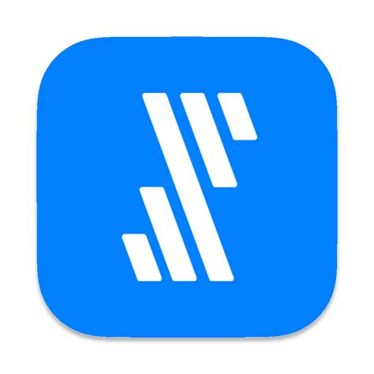

# Fivetran

- [REST API](REST.md)

## データパイプライン

- データ統合自動化サービス

ETL(Integrate.io):

    - E：Extract(抽出)
    - T：Transform(変換/加工)
    - L：Load(ロード)

ELT(Fivetran):

    - E：Extract(抽出)
    - L：Load(ロード)
    - T：Transform(変換/加工)

## モダンデータスタック

- https://www.youtube.com/watch?v=ASQO3qVPWps
- SaaSツールを活用したクラウドベース 

## 資料

- [自動データパイプラインサービス 「Fivetran（ファイブトラン）」](https://classmethod.jp/partner/fivetran/)
- [Fivetranとは？-機能/概要紹介-](https://dev.classmethod.jp/articles/what-is-fivetran/)

## YouTube

- [Fivetranはじめの一歩](https://www.youtube.com/watch?v=BOyHOOGXLBo)