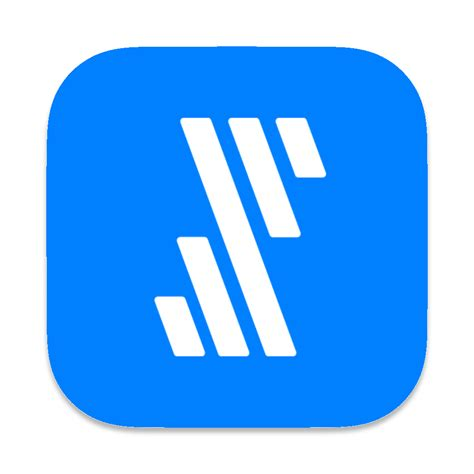

# Fivetran

- [REST API](REST.md)
- [冪等生](idempotence.md)

データ抽出から保存:

1. データ集出
2. 抽出完了確認
3. データ整形
4. データ正規化
5. 整合性チェック
6. DWH保存 

考慮:

- スキーマ変更
- スキーマ移行
- データ差分変更
- 障害復旧
## データパイプライン

- データ統合自動化サービス

ETL(Integrate.io):

    - E：Extract(抽出)
    - T：Transform(変換/加工)
    - L：Load(ロード)

ELT(Fivetran):

    - E：Extract(抽出)
    - L：Load(ロード)
    - T：Transform(変換/加工)

## モダンデータスタック

- https://www.youtube.com/watch?v=ASQO3qVPWps
- SaaSツールを活用したクラウドベース 

## 資料

- [自動データパイプラインサービス 「Fivetran（ファイブトラン）」](https://classmethod.jp/partner/fivetran/)
- [Fivetranとは？-機能/概要紹介-](https://dev.classmethod.jp/articles/what-is-fivetran/)

## YouTube

- [Fivetranはじめの一歩](https://www.youtube.com/watch?v=BOyHOOGXLBo)
- [Fivetran と Snowflake で Salesforce データ分析環境をお手軽構築 #devio2020](https://www.youtube.com/watch?v=R-9VnP3_DDM)
- [データ集約をノーコーディングで！「Fivetran」を使った自動データパイプライン構築 #devio_showcase](https://www.youtube.com/watch?v=zfyQMOncbDw)
- [自動データパイプラインサービス「Fivetran」のUIを解説してみた #mds_series #01](https://www.youtube.com/watch?v=cii82mVyMUk)
- [自動データパイプラインサービス「Fivetran」の管理画面を解説してみた #mds_series #02](https://www.youtube.com/watch?v=Yd07RA-h9nU)

## 費用

- [Fivetran の費用試算のポイントまとめ](https://dev.classmethod.jp/articles/fivetran-price/)

## Redshift

- [Redshiftはターゲットであり、データソースのサポートはない](https://fivetran.com/docs/databases/faq/redshift-source-connector)
- [データを Amazon S3 にアンロードする](https://docs.aws.amazon.com/ja_jp/redshift/latest/dg/t_Unloading_tables.html)

## 記事

- [[事例] Snowflake社の成長の秘密：Fivetranで業界トップクラスのデータ分析基盤を構築](https://resources.fivetran.com/japanese-content/snowflake-builds-a-best-in-class-data-stack-with-fivetran-jp)

