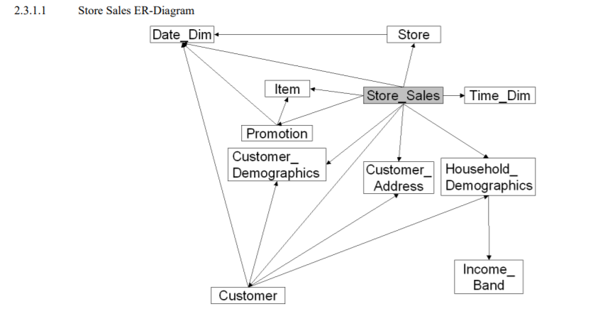
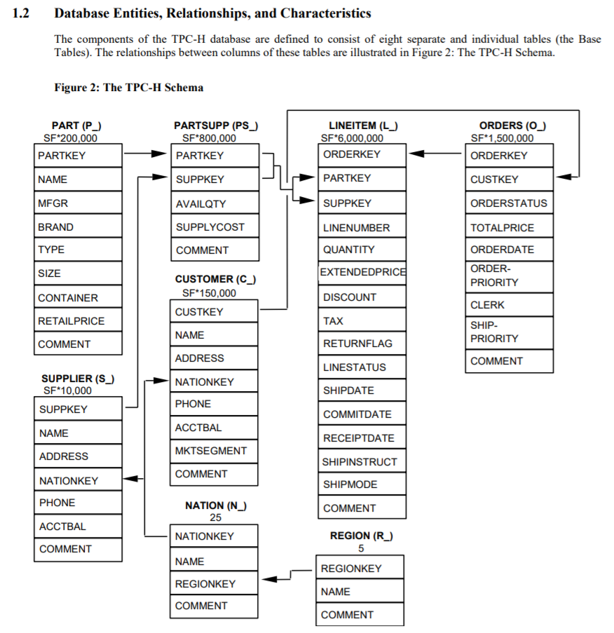

# SNOWFLAKE_SAMPLE_DATA

- https://dev.classmethod.jp/articles/snowflake-sample-data/
- https://www.tpc.org/tpc_documents_current_versions/current_specifications5.asp

## TPCDS_SF

- [サンプルデータ: TPC-DS](https://docs.snowflake.com/ja/user-guide/sample-data-tpcds.html) (小売製品サプライヤーの意思決定支援機能をモデル化。スキーマには、顧客、注文、製品データなどの重要なビジネス情報が含まれています。)

## TPCH_SF(Scale Factor)

- https://docs.snowflake.com/ja/user-guide/sample-data-tpch.html
- [データベースの性能検証に利用されるTPC-HとTPC-DSに関するざっくりとした整理](https://qiita.com/manabian/items/93d9330cdb607383c2b9)
- [データベース負荷テストツールまとめ(3)](https://sh2.hatenablog.jp/entry/20100112)
- [データベースベンチマークTPC-HをMySQLで実行する(TPC-H v2.18.0)](https://qiita.com/myoshimi/items/bd460164af48ece1ab2d)

| テーブル | 説明          |
| -------- | ------------- |
| orders   | 注文          |
| lineitem | 注文明細      |
| part     | 部品          |
| supplier | 仕入れ先      |
| partsupp | 部品-仕入れ先 |
| customer | 顧客          |
| nation   | 国            |
| region   | 地域          |