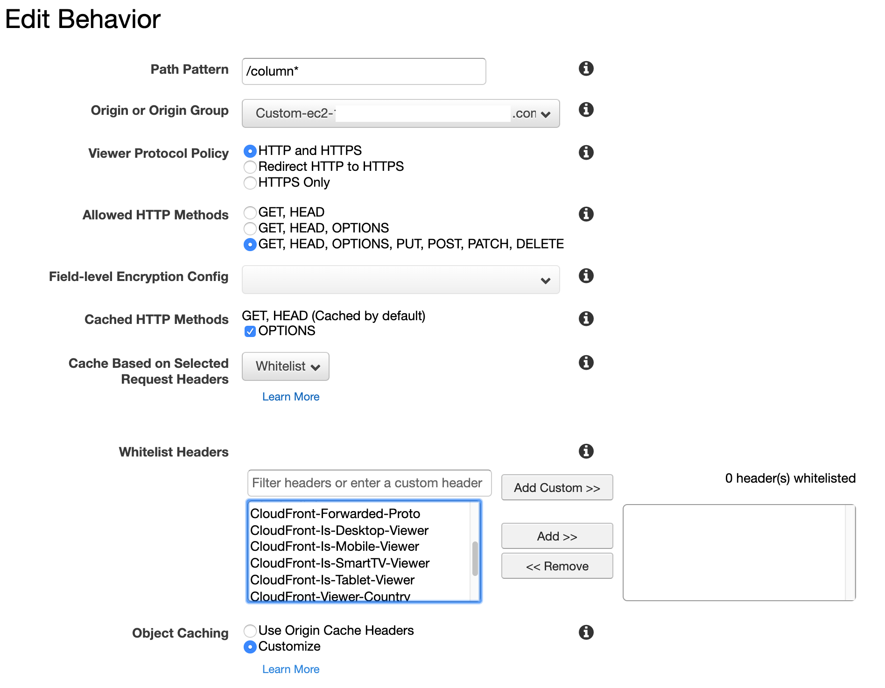
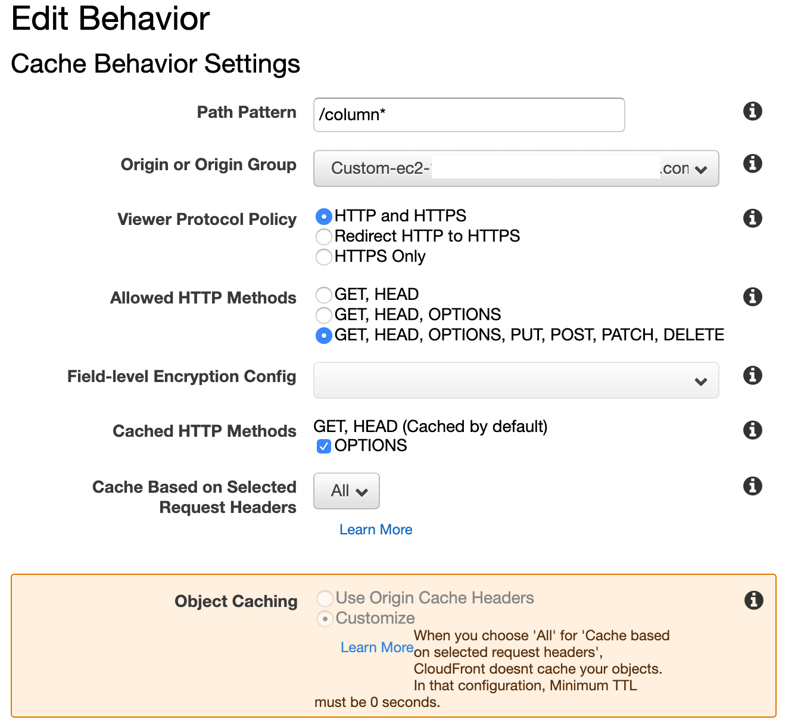

# リクエストヘッダーに基づくコンテンツのキャッシュ(`Cache Based on Selected Request Headers`)

- [リクエストヘッダーに基づくコンテンツのキャッシュ - Amazon CloudFront](https://docs.aws.amazon.com/ja_jp/AmazonCloudFront/latest/DeveloperGuide/header-caching.html)
- [カスタムオリジンの場合のリクエストとレスポンスの動作 - Amazon CloudFront](https://docs.aws.amazon.com/ja_jp/AmazonCloudFront/latest/DeveloperGuide/RequestAndResponseBehaviorCustomOrigin.html)

## 選択転送(`Whitelist`)

## 全転送(`all`)

## `Host`(nginx`$host`)

- ヘッダー転送を設定すると,CloudFrontの `CName` が `Host` としてオリジン(`nginx`) におくられます
