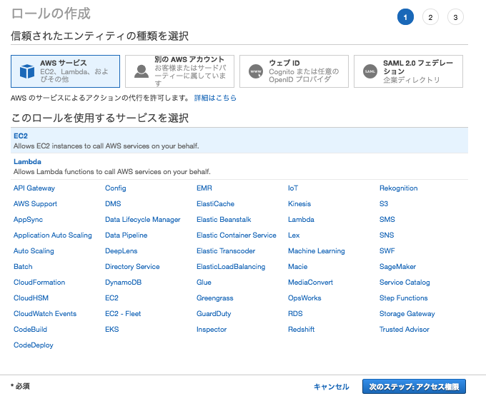
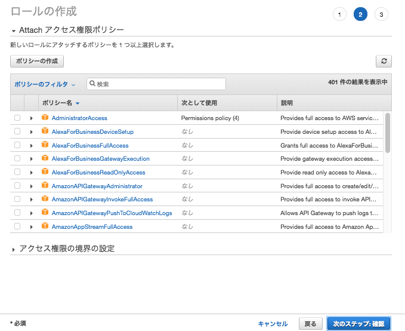
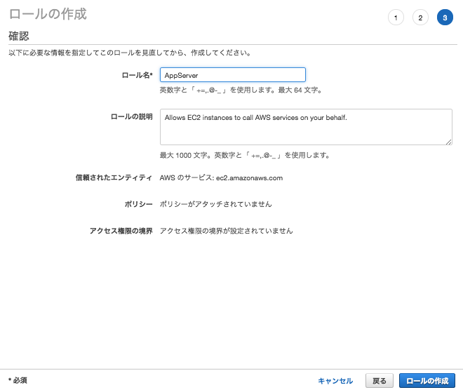
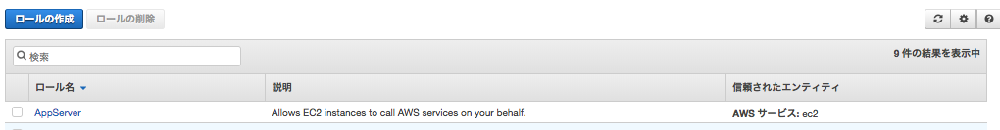
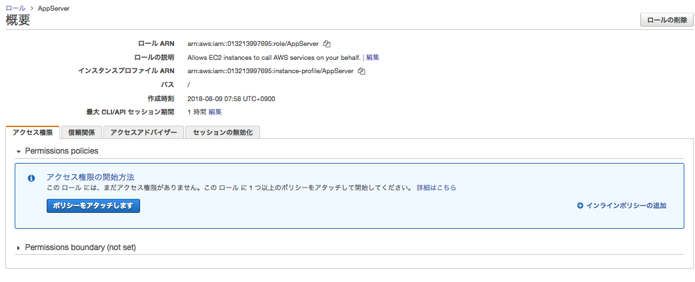
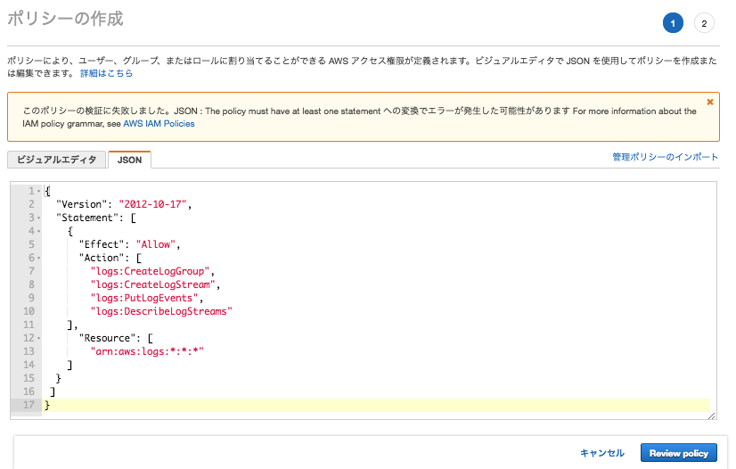
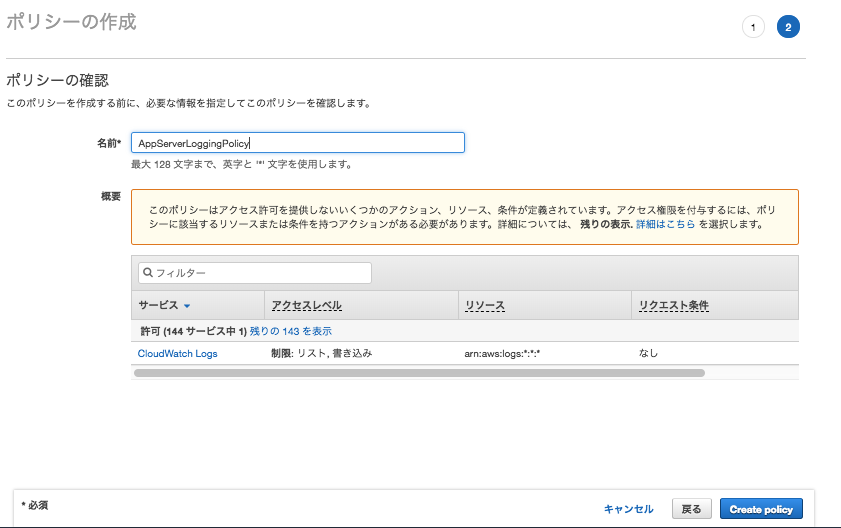
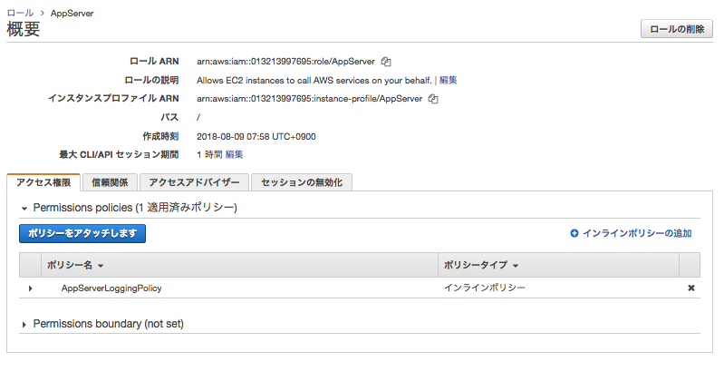

# `AWSサービス` ロール作成

## 「インランポリシーの追加」

## JSONをコピペ

~~~json
{
  "Version": "2012-10-17",
  "Statement": [
    {
      "Effect": "Allow",
      "Action": [
        "logs:CreateLogGroup",
        "logs:CreateLogStream",
        "logs:PutLogEvents",
        "logs:DescribeLogStreams"
    ],
      "Resource": [
        "arn:aws:logs:*:*:*"
    ]
  }
 ]
}
~~~

## 保存

