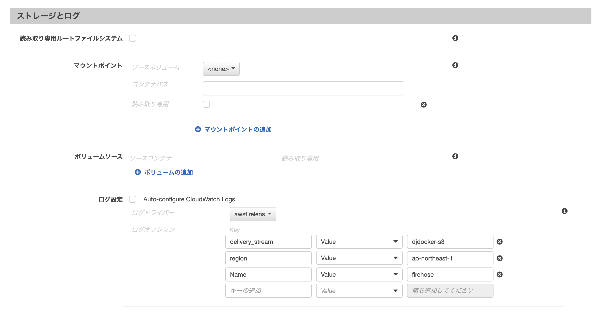

# FireLens

## タスクロールに Firehoseの権限を与える

**タスクロール** に ポリシーを追加:

~~~json
{
    "Version": "2012-10-17",
    "Statement": [
        {
            "Effect": "Allow",
            "Action": "firehose:PutRecordBatch",
            "Resource": "*"
        }
    ]
}
~~~

## アプリケーションコンテナのログ設定: ログドライバーに　**awsfirelens** を指定

| **項目**          | **値**             | **例**           |
| ----------------- | ------------------ | ---------------- |
| `Name`            | `firehose`         |                  |
| `region`          | Firehoseリージョン | `ap-northeast-1` |
| `delivery_stream` | Firehose名         | `djdocker-s3`    |

## `log_route` コンテナが作成される

- Amazonの Firelens用のDockerイメージが採用される
- メモリ制限の設定

## タスク定義

タスクメモリの変更 :

- 増やす

ログルーター:

- Firelensの統合を有効にする: `チェック`  (されている) 
- タイプ: `fluentbit`
- イメージ: `906394416424.dkr.ecr.ap-northeast-1.amazonaws.com/aws-for-fluent-bit:latest` (Amazonのイメージ)
  

## 記事

- [[アップデート] ECS/Fargateでログ出力先をカスタマイズできる「FireLens」機能がリリースされました](https://dev.classmethod.jp/articles/ecs-firelens/)
- [AWS CloudWatch Logs のログデータを S3 に配信する（Kinesis Data Firehose）](https://techblog.roxx.co.jp/entry/2021/01/19/102201)
- [AWS Kinesis を使って S3 にちょっとずつ書き込む。](https://qiita.com/propella/items/c02b6b74483214d3130c)
