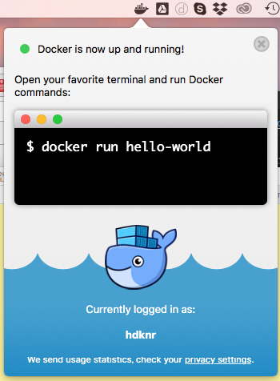
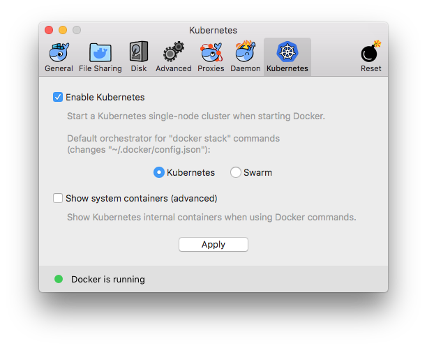
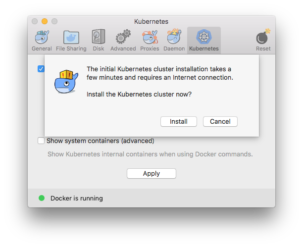
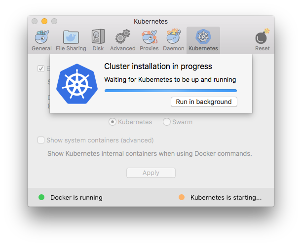

## Docker for Mac

- https://store.docker.com/editions/community/docker-ce-desktop-mac
- `Edge` バージョンをダウンロードする
- Docker.dmgでドラッグロドップインストール

## インストール

- 
- 
- 
- 

注意:

- brew で kubectrl をインストール済みであれば、先に削除すること

## コマンド

~~~bash 
$ which docker
/usr/local/bin/docker
~~~

~~~bash 
$ docker version
Client:
 Version:           18.06.0-ce
 API version:       1.38
 Go version:        go1.10.3
 Git commit:        0ffa825
 Built:             Wed Jul 18 19:05:26 2018
 OS/Arch:           darwin/amd64
 Experimental:      false

Server:
 Engine:
  Version:          18.06.0-ce
  API version:      1.38 (minimum version 1.12)
  Go version:       go1.10.3
  Git commit:       0ffa825
  Built:            Wed Jul 18 19:13:46 2018
  OS/Arch:          linux/amd64
  Experimental:     true
(anaconda3-4.3.1) bash-4.4$ docker version
Client:
 Version:           18.06.0-ce
 API version:       1.38
 Go version:        go1.10.3
 Git commit:        0ffa825
 Built:             Wed Jul 18 19:05:26 2018
 OS/Arch:           darwin/amd64
 Experimental:      false

Server:
 Engine:
  Version:          18.06.0-ce
  API version:      1.38 (minimum version 1.12)
  Go version:       go1.10.3
  Git commit:       0ffa825
  Built:            Wed Jul 18 19:13:46 2018
  OS/Arch:          linux/amd64
  Experimental:     true
~~~

~~~bash 
$ docker ps
CONTAINER ID        IMAGE               COMMAND             CREATED             STATUS              PORTS               NAMES
~~~

~~~bash 
$ docker info
Containers: 0
 Running: 0
 Paused: 0
 Stopped: 0
Images: 0
Server Version: 18.06.0-ce
Storage Driver: overlay2
 Backing Filesystem: extfs
 Supports d_type: true
 Native Overlay Diff: true
Logging Driver: json-file
Cgroup Driver: cgroupfs
Plugins:
 Volume: local
 Network: bridge host ipvlan macvlan null overlay
 Log: awslogs fluentd gcplogs gelf journald json-file logentries splunk syslog
Swarm: inactive
Runtimes: runc
Default Runtime: runc
Init Binary: docker-init
containerd version: d64c661f1d51c48782c9cec8fda7604785f93587
runc version: 69663f0bd4b60df09991c08812a60108003fa340
init version: fec3683
Security Options:
 seccomp
  Profile: default
Kernel Version: 4.9.93-linuxkit-aufs
Operating System: Docker for Mac
OSType: linux
Architecture: x86_64
CPUs: 2
Total Memory: 1.952GiB
Name: linuxkit-025000000001
ID: FH6E:FZEA:KPBS:PEL2:YOZ6:N6Z6:JMVO:Z2QB:H2CL:EEPK:6F5S:WB6X
Docker Root Dir: /var/lib/docker
Debug Mode (client): false
Debug Mode (server): true
 File Descriptors: 24
 Goroutines: 50
 System Time: 2018-07-26T08:11:16.806908167Z
 EventsListeners: 2
HTTP Proxy: gateway.docker.internal:3128
HTTPS Proxy: gateway.docker.internal:3129
Registry: https://index.docker.io/v1/
Labels:
Experimental: true
Insecure Registries:
 127.0.0.0/8
Live Restore Enabled: false
~~~

## kubectl 

~~~bash 
$ which kubectl
/usr/local/bin/kubectl
~~~

クラスタが docker-for-desktop であることを確認(コマンドもしくはメニューバーから変更可能)：

~~~bash 
$ kubectl config get-contexts

CURRENT   NAME                 CLUSTER                      AUTHINFO             NAMESPACE
*         docker-for-desktop   docker-for-desktop-cluster   docker-for-desktop
~~~

ノード:

~~~bash 
$ kubectl get nodes

NAME                 STATUS    ROLES     AGE       VERSION
docker-for-desktop   Ready     master    7m        v1.10.3
~~~
