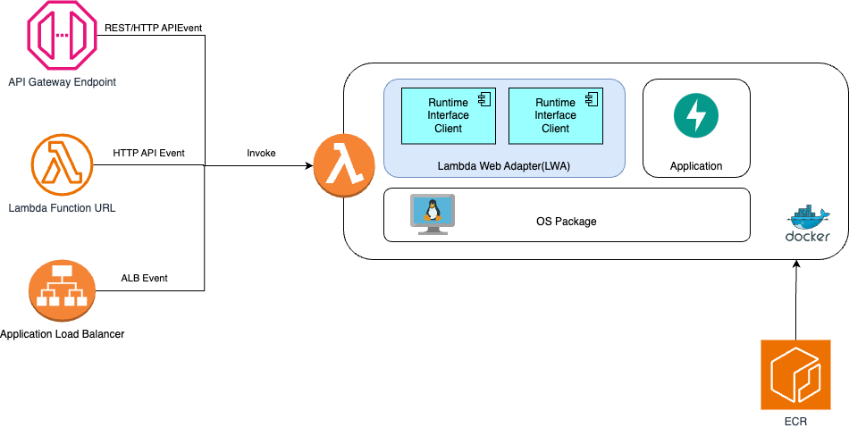

# Lambda Web Adapter

- https://github.com/awslabs/aws-lambda-web-adapter



- [Lambda Web Adapter でウェブアプリを (ほぼ) そのままサーバーレス化する](https://aws.amazon.com/jp/builders-flash/202301/lambda-web-adapter/)
- [AWS Lambda Web Adapter を使って Agents for Amazon Bedrock を高速開発](https://qiita.com/moritalous/items/f828c5d7d2d116884f9a)
- [Agents for Amazon Bedrock with FastAPI example](https://github.com/moritalous/lwa-fastapi-middleware-bedrock-agent/tree/main/example/bedrock-agent-fastapi)

## Docker

```dockerfile

# 1. AWS のベースイメージ(Amazon  Linux)
FROM public.ecr.aws/lambda/python:3.12

# 2. LWA(Lmabda Web Adapter) の導入
# https://github.com/awslabs/aws-lambda-web-adapter?tab=readme-ov-file#configurations
COPY --from=public.ecr.aws/awsguru/aws-lambda-adapter:0.8.3 /lambda-adapter /opt/extensions/lambda-adapter

# 3. LWA -> アプリケーションの接続ポート
ENV PORT=8000

# 4. アプリケーション
COPY streamingapi/main.py ${LAMBDA_TASK_ROOT}/
COPY pyproject.toml poetry.lock ${LAMBDA_TASK_ROOT}/
COPY packages/ ${LAMBDA_TASK_ROOT}/packages/
#
RUN dnf install gcc-c++ -y
#
RUN pip install pip -U
RUN pip install poetry
RUN poetry config virtualenvs.create false
RUN poetry install --no-root --no-dev

# 5. ベースイメージのエントリポイントの上書き
# https://docs.docker.jp/engine/reference/builder.html#entrypoint
# (FastAPIアプリを uvicronでホストする)
ENTRYPOINT ["uvicorn"]

# 6. エントリポイントの引数
CMD [ "main:app", "--host", "0.0.0.0", "--port", "8000"]
```
