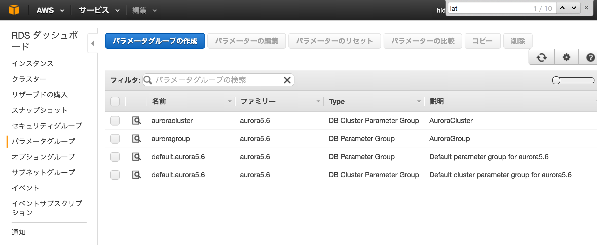
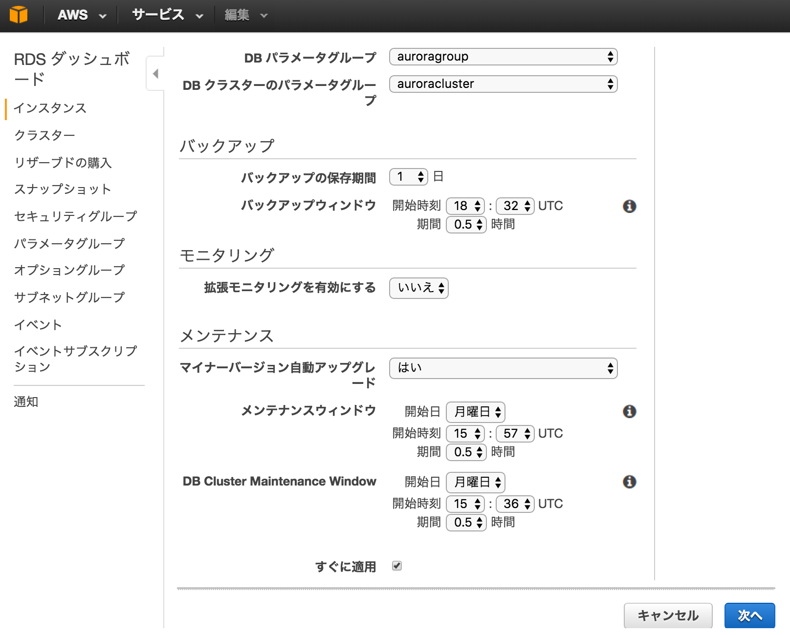

~~~mysql

mysql> show variables like '%char%';
+--------------------------+-----------------------------------------------+
| Variable_name            | Value                                         |
+--------------------------+-----------------------------------------------+
| character_set_client     | utf8                                          |
| character_set_connection | utf8                                          |
| character_set_database   | utf8                                          |
| character_set_filesystem | utf8                                          |
| character_set_results    | utf8                                          |
| character_set_server     | utf8                                          |
| character_set_system     | utf8                                          |
| character_sets_dir       | /rdsdbbin/oscar-5.6.10a.16.39/share/charsets/ |
+--------------------------+-----------------------------------------------+
8 rows in set (0.00 sec)

~~~

~~~bash
$ echo "show tables" | DJ dbshell | grep -v "Tables" | while read l; do echo "ALTER TABLE ${l}  CONVERT TO CHARACTER SET UTF8" | DJ dbshell; done
$ echo "ALTER DATABASE yourdb default character set utf8;"  | mysql -u root -h aurorahost -p
~~~
