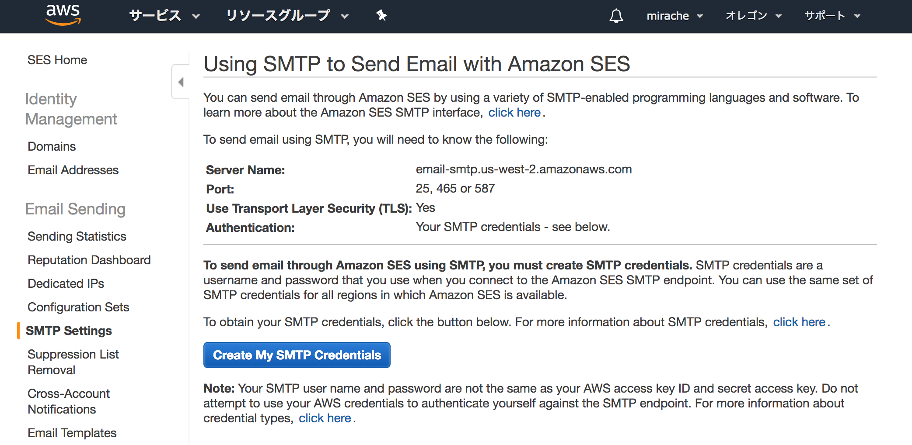
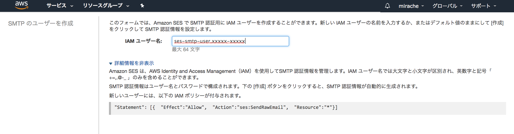
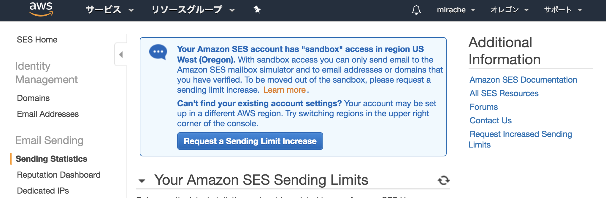

- [Amazon SES と Postfix の統合 - Amazon Simple Email Service](https://docs.aws.amazon.com/ja_jp/ses/latest/DeveloperGuide/postfix.html)
- [EC2上のPostfixからSES経由でメール送信 - Qiita](https://qiita.com/taishin/items/42f90d8f86ad4488786e)

## AWS SES

Email Addresses:

- メールアドレスを追加
- ベリファイさせる

## SES: SMTP Settings

- `SMTP Settings` > `Create My SMTP Credentials`

 
 
 

生成したクレデンシャルを控える(ダウンロード)する。

## Postfix

~~~bash
$ sudo apt-get install postfix mailutils
~~~

### /etx/postfix/main.cf

~~~
 relayhost = [email-smtp.us-west-2.amazonaws.com]:587
 smtp_sasl_auth_enable = yes
 smtp_sasl_security_options = noanonymous
 smtp_sasl_password_maps = hash:/etc/postfix/sasl_passwd
 smtp_use_tls = yes
 smtp_tls_security_level = encrypt
 smtp_tls_note_starttls_offer = yes
~~~

### /etx/postfix/master.cf

~~~
#       -o smtp_fallback_relay=
~~~

### /etc/postfix/sasl_passwd

~~~
[email-smtp.us-west-2.amazonaws.com]:587 `SMTP ユーザー名`:`SMTP パスワード`
~~~

~~~bash
$ sudo postmap etc/postfix/sasl_passwd
$ sudo chmod 600 /etc/postfix/sasl_passwd.db
~~~

###  /etc/ssl/certs/ca-certificates.crt

~~~bash
$ sudo postconf -e 'smtp_tls_CAfile = /etc/ssl/certs/ca-certificates.crt'
~~~

~~~bash
$ sudo /etc/init.d/postfix restart
~~~

## 解除制限

- https://aws.amazon.com/forms/ec2-email-limit-rdns-request?catalog=true&isauthcode=true

`Sending Statistice` > `Request a Sending limit Increase`:

