## 0. 新規VPC

-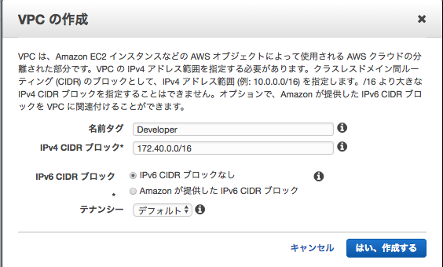

## 1. 新規インターネットゲートウェイ

- 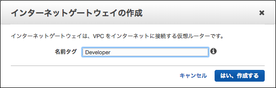

## 2. インターネットゲートウェイをVPCにアタッチ

- 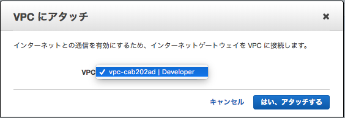			

## 3-6. サブネット作成

- 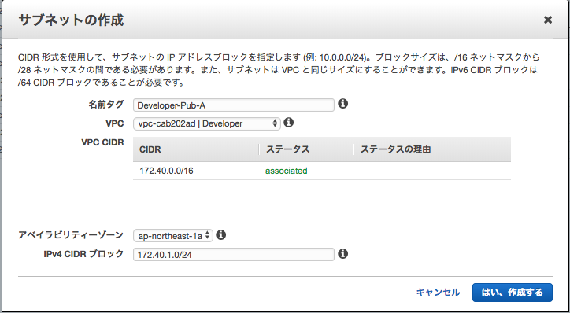
- 
- 
- 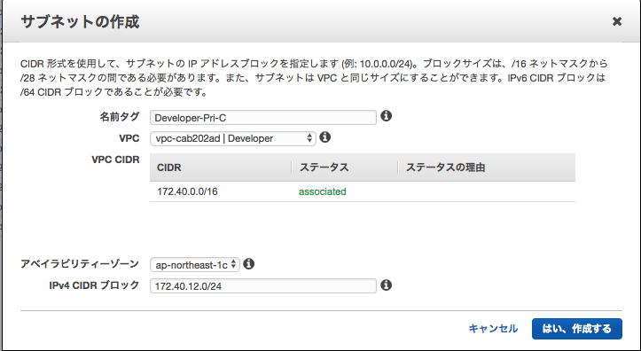

7.サブネット確認:

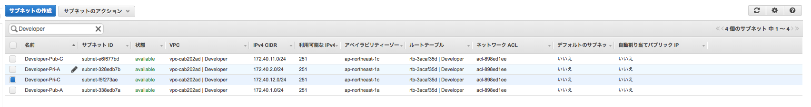

## 8. ルーティングテーブル作成

- 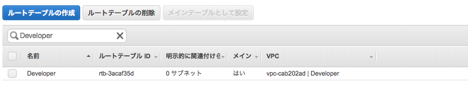

## 9-10. ルートの追加

- 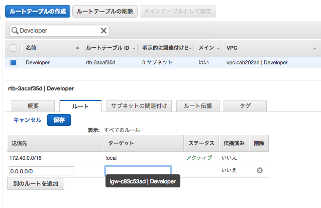
- 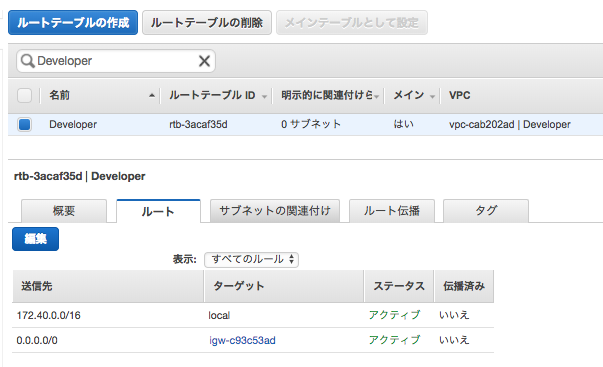

## 11-12. ルーティングテーブルにサブネットの割り当て

- 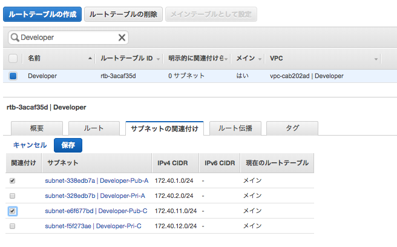
- 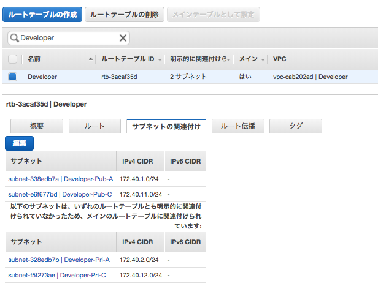

## 13. インスタンスに公開DNSを割り当てる

- 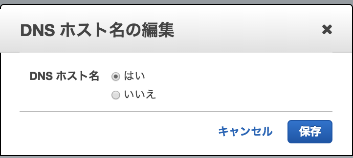
