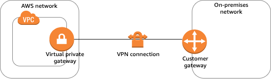
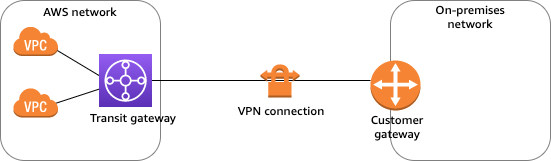
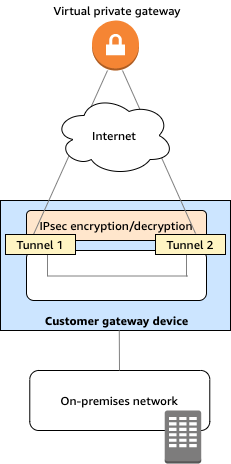

# コンポーネント

## VGW: [仮想プライベートゲートウェイ](https://docs.aws.amazon.com/ja_jp/vpn/latest/s2svpn/how_it_works.html#VPNGateway)

- AWS側の VPN コンセントレータ
- ASN(プライベート自律システム番号)を設定(デフォルト`64512`)

## TGW: [転送(トランジット)ゲートウェイ](https://docs.aws.amazon.com/ja_jp/vpn/latest/s2svpn/how_it_works.html#Transit-Gateway)

- 中継ハブ

## CGW: [カスタマーゲートウェイデバイス](https://docs.aws.amazon.com/ja_jp/vpn/latest/s2svpn/how_it_works.html#CustomerGatewayDevice)

- [ユーザー側にある物理的なデバイスまたはソフトウェアアプリケーション](https://docs.aws.amazon.com/ja_jp/vpn/latest/s2svpn/your-cgw.html)
- トラフィックを生成して Internet Key Exchange (IKE) ネゴシエーションプロセスを開始することで、Site-to-Site VPN 接続のトンネルを開始する必要があります。(AWS起動トラフィックに関しては[オプション](https://docs.aws.amazon.com/ja_jp/vpn/latest/s2svpn/initiate-vpn-tunnels.html)) 

## [カスタマーゲートウェイ](https://docs.aws.amazon.com/ja_jp/vpn/latest/s2svpn/how_it_works.html#CustomerGateway)

- AWS に作成するリソースで、オンプレミスネットワーク内のカスタマーゲートウェイデバイスを表します
