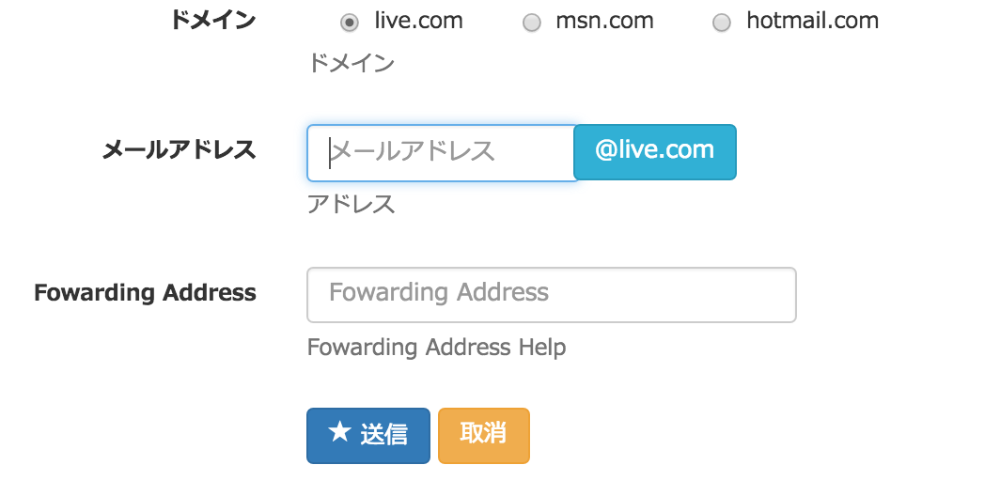

転送メールアドレス設定

- input[type=radio] を水平に並べる
- 選択されたドメインをメールアドレス入力の右横に表示させる

## horizontal フォーム

- [django-bootstrap3: Template tags and filters](https://django-bootstrap3.readthedocs.org/en/latest/templatetags.html)

~~~html
<form method="post"
  action=""
  class="form-horizontal"> {# これを指定しないと、radio-inline の１つ目の水平が崩れる #}
  
  

  

  {# INPUT が大きすぎるのでfield_class で幅を小さくする #}
        
  

  

    {# offset-3 でラベルの幅分、インデントさせる #}
    

    <button type="submit" class="btn btn-primary">
    
    </button>
    <a class="btn btn-warning"
      href="{{ profile.get_absolute_url }}"></a>
    

  

</form>
~~~

### form クラス

~~~py
class EmailForwardForm(forms.Form, PreviewMixin):                                        
    user = forms.CharField( required=True)
    domain = forms.ChoiceField(
        choices=tuple((i, i) for i in DOMAINS),                                     
        widget=forms.RadioSelect, required=True)
    forward = forms.EmailField(required=True)
~~~        

## ドメインを選択したら表示を変える

~~~javascript

~~~

## 表示

