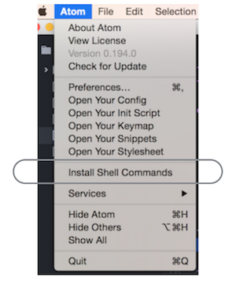

## Atom

### シェルコマンド

~~~bash

$ apm

apm - Atom Package Manager powered by https://atom.io

Usage: apm <command>

where <command> is one of:
    clean, config, dedupe, deinstall, delete, dev, develop, docs, erase,
    featured, home, init, install, link, linked, links, list, ln, lns, login,
    ls, open, outdated, publish, rebuild, rebuild-module-cache, remove, rm,
    search, show, star, starred, stars, test, uninstall, unlink, unpublish,
    unstar, update, upgrade, view.

Run `apm help <command>` to see the more details about a specific command.

Options:
  --version, -v  Print the apm version   
  --help, -h     Print this usage message
  --color        Enable colored output     [boolean]  [default: true]

  Prefix an option with `no-` to set it to false such as --no-color to disable
  colored output.
~~~
  
### vim

- [vim-mode](https://github.com/atom/vim-mode)
- [ATOMエディタの初期設定(vim mode)](http://qiita.com/joe-re/items/c46f23b0521a40ff43e6)

~~~bash
$ apm install vim-mode
~~~
