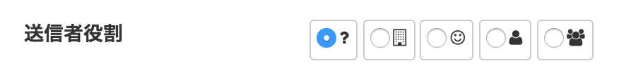

django: RadioSelectの選択アイテムを fontawesome でラベル化

# anyenv : pyenv + ndenv

## anyenv.bash

~~~
export PATH="$HOME/.anyenv/bin:$PATH"
eval "$(anyenv init -)"
 
for D in `\ls $HOME/.anyenv/envs`; do
    export PATH="$HOME/.anyenv/envs/$D/shims:$PATH"
done
 
function ANYENV_PLUGIN()
{
    mkdir -p $(anyenv root)/plugins;
    git clone https://github.com/znz/anyenv-update.git $(anyenv root)/plugins/anyenv-update;
}

function ANYENV_PYENV_VIRTUALENV()
{
	git clone https://github.com/yyuu/pyenv-virtualenv.git ~/.anyenv/envs/pyenv/plugins/pyenv-virtualenv
}
~~~

## install anyenv

~~~
$ git clone https://github.com/riywo/anyenv ~/.anyenv
~~~
~~~
$ source ~/anyenv.bash
~~~

##  install ndenv + node.js

~~~
$ anyenv install ndenv
$ source ~/bin/env/anyenv.bash
~~~

~~~
$ ndenv install 0.12.0
$ ndenv global 0.12.0
$ source ~/bin/env/anyenv.bash
~~~

## install bower

~~~
$ npm install bower -g
$ source ~/bin/env/anyenv.bash
~~~

## install pyenv , python

~~~
$ anyenv install pyenv
$ source ~/bin/env/anyenv.bash
$ pyenv  install 2.7.8
$ pyenv global 2.7.8
$ pip install django 
~~~

## install dajngo ...

- requirements.txt
- [django-bootstrap3](http://django-bootstrap3.readthedocs.org/en/latest/)
- [bambu-bootstrap](http://bambu-bootstrap.readthedocs.org/en/latest/)
- [django-bower](https://django-bower.readthedocs.org/en/latest/)

~~~
Django
bambu-bootstrap
beautifulsoup4
django-bootstrap3
django-bower
...
~~~

~~~
$ pip install -r requirements.txt
~~~

# Django アプリケーション設定

## settings.py : bootstrap3 の設定

- django のプロジェクト作成すみ
- settings.py 

~~~
from django.conf import global_settings

MEDIA_ROOT = os.path.join(BASE_DIR, 'medias/')
STATIC_ROOT = os.path.join(BASE_DIR, 'static/')
INSTALLED_APPS += (
    'bootstrap3',   	# django-bootstrap3
    'djangobower',  	# django-bower
    'bambu_bootstrap',  # bambu
)
STATICFILES_FINDERS = global_settings.STATICFILES_FINDERS + (
    'djangobower.finders.BowerFinder',
)

BOWER_COMPONENTS_ROOT = os.path.join(BASE_DIR, 'components/')
BOWER_INSTALLED_APPS = (
    'bootstrap',
    'fontawesome',
    'jquery-ui',
    'lightbox2',
)
~~~

## Bootstrap 関連インストール

~~~
$ python manage.py bower install
~~~

~~~
$ python manage.py collectstatic
~~~

# forms.py

## IconModelChoiceField

- Roleモデルの symbol フィールドにfontawesomeのclassを入れてる

~~~
>>> [ r.symbol for r in Role.objects.all()]
[u'fa-building-o', u'fa-smile-o', u'fa-user', u'fa-users']
~~~

- Role をModelChoiceFieldで参照するフォームでのレンダリングを派生クラスで

~~~
class IconModelChoiceField(forms.ModelChoiceField):   
                             
    def __init__(self, *args, **kwargs):                                            
        kwargs['widget'] = forms.RadioSelect()                                      
        kwargs['empty_label'] = mark_safe(                                          
            '<i class="fa fa-question fa-1x" title=""></i>')                        
        super(IconModelChoiceField, self).__init__(*args, **kwargs)                 
                                                                                    
    def label_from_instance(self, obj):                                             
        if isinstance(obj, models.Role):                                            
            return mark_safe('<i class="fa {0} fa-1x" title="{1}"></i>'.format(  
                obj.symbol, obj.__unicode__().encode('utf8')))                      
                                                                                    
        return super(IconModelChoiceField, self).label_from_instance(obj)           
~~~

## ActionFrom

- Roleを選択させます

~~~
class ActionExForm(ActionForm):                                                     

    initiator_role = IconModelChoiceField(                                       
        label=_('Initiator Role'), required=True,                                
        queryset=models.Role.objects.all(),)                                     
~~~

# action_edit.html

- form

~~~
  

    <label class="col-md-2 control-label" for="id_initiator_role">
    {{ form.initiator_role.label }}
    </label>
    

        {{ form.initiator_role}}
    

  

~~~

- javascript

~~~

~~~

- レンダリング

