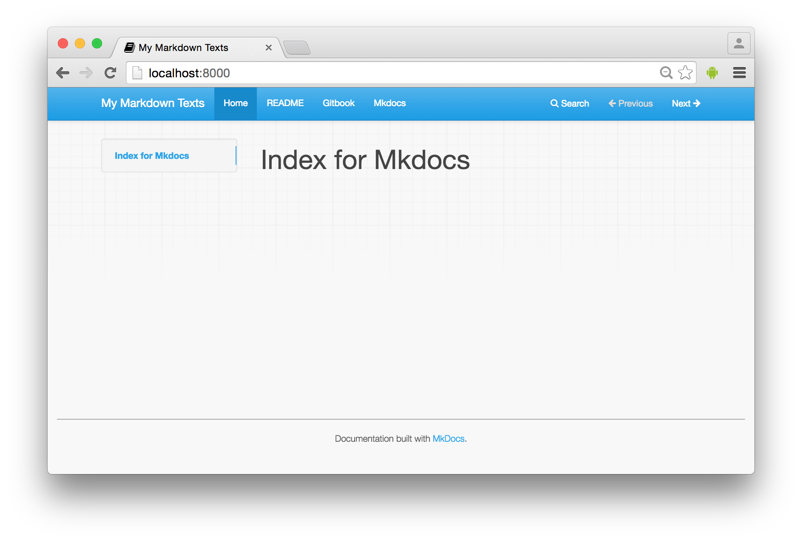

# mkdocs 

- http://www.mkdocs.org/
- http://mkdocs.readthedocs.io/en/stable/

## インストール

~~~bash
$ pip install mkdocs -U

...
Successfully installed Markdown-2.6.6 certifi-2016.2.28 click-6.6
livereload-2.4.1 mkdocs-0.15.3 mkdocs-bootstrap-0.1.1 mkdocs-bootswatch-0.4.0 six-1.10.0
~~~

~~~bash
$ mkdocs --version
mkdocs, version 0.15.3
~~~

## 最小

~~~bash
$ cat ./mkdocs.yml

site_name: My Markdown Texts
~~~

~~~bash
$ cat docs/index.md

# Index for Mkdocs
~~~

~~~bash
$ mkdocs serve
INFO    -  Building documentation...
INFO    -  Cleaning site directory
[I 160504 10:20:34 server:281] Serving on http://127.0.0.1:8000
[I 160504 10:20:34 handlers:59] Start watching changes
[I 160504 10:20:34 handlers:61] Start detecting changes
INFO    -  Building documentation...
INFO    -  Cleaning site directory
[W 160504 10:20:56 web:1946] 404 GET /fonts/fontawesome-webfont.woff2?v=4.5.0 (127.0.0.1) 2.10ms
[I 160504 10:20:56 handlers:132] Browser Connected: http://localhost:8000/
~~~

