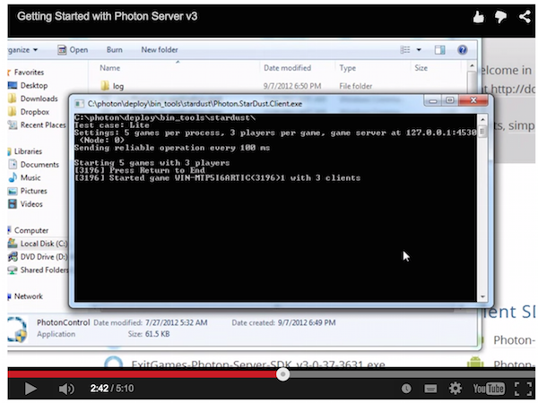

## Photon Server はじめに

### 1. SDK + Free ライセンスダウンロード

- ログインする

### 2. 解答しインストール実行

### 3. "deploy" ディレクトリ

- bin_tool (ダッシュボード)
- bin_win(32, 64, xp)

### 4. bin_win64¥PhotonControl.exe

### 5. ライセンス確認

### 6. タスクトレイでコントローラから

### 7. "log" ディレクトリにログが描かれる

### 8. テストクライアントの実行

### 9. アプリケーション停止

### 10. ライセンスファイルのコピー

### 11. ライセンスファイルを実行ディレクトリにペースト

### 12. 再起動してライセンス確認

