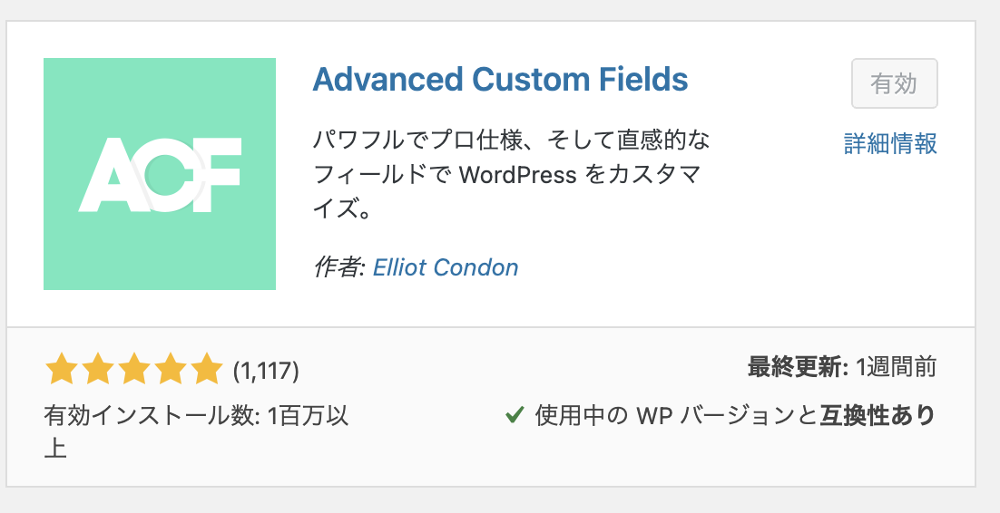
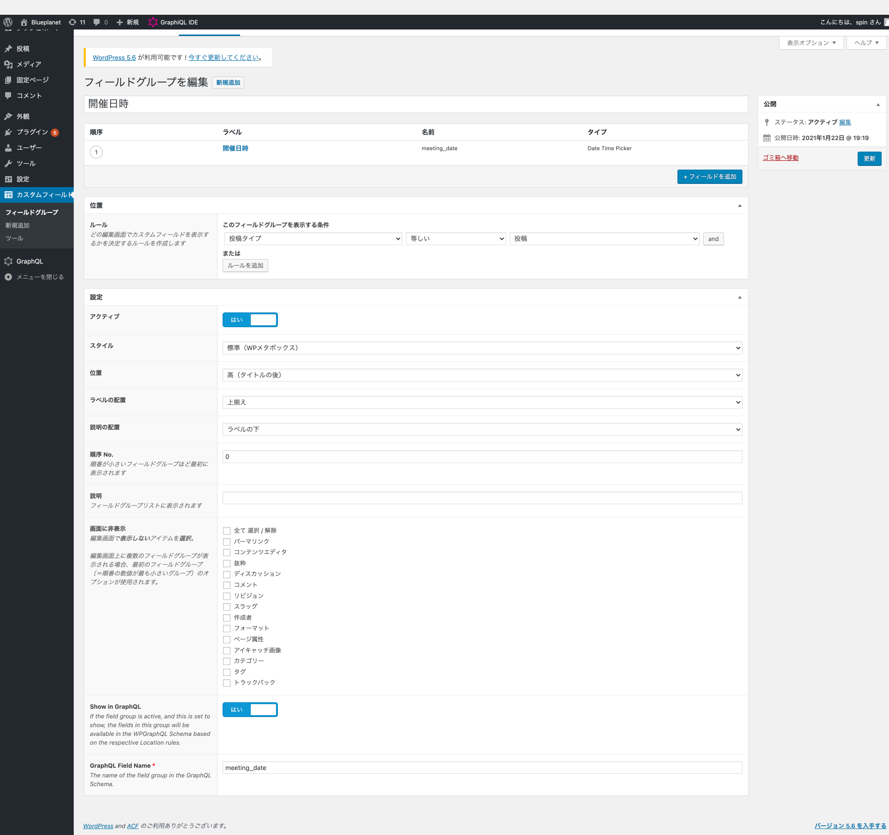
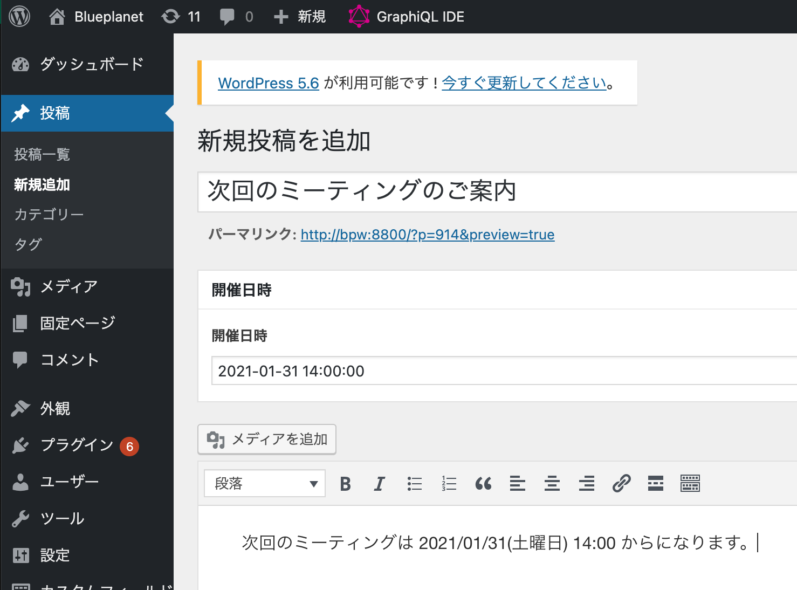
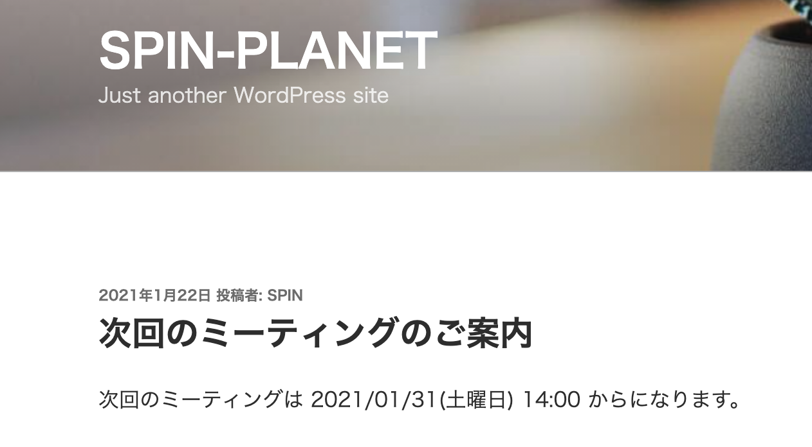
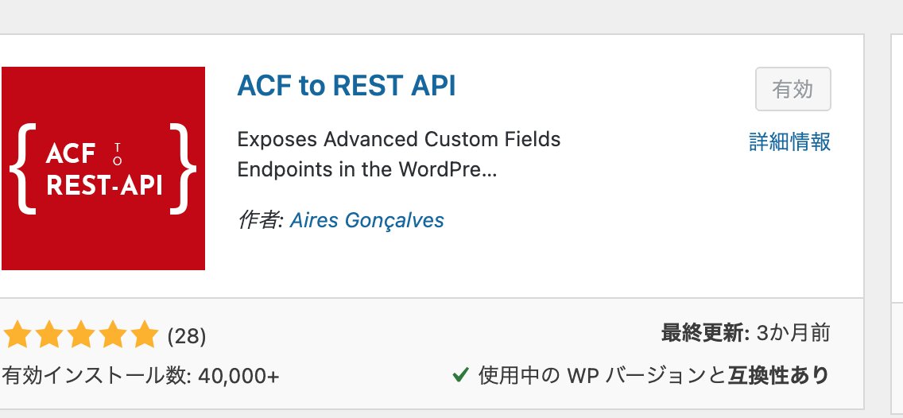
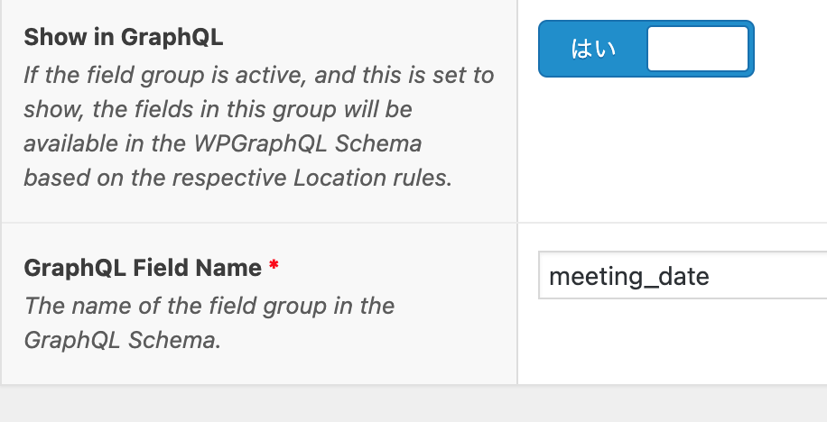

# Advanced Custome Fields 

- PostMeta にカスタム情報を保存する為のプラグイン

## 登録

### 追加

フィールドグループの追加:

- `開催日時` を `Date Time Picker` で　`meeting_date` として追加

ルールの設定:

- Postの全てに追加してみる
- `投稿タイプ` に対して `等しい` -> `投稿` をルール追加 

設定:

- `アクティブ` : `はい`
- `位置`: `高(タイトルの後)

### 投稿の編集と`開催日時`の追加

記事の確認:

- メタデータは表示されません。表示するにはテーマを編集する必要があります。
  

データの確認:

- データは保存されています

~~~mysql
mysql> select * from wp_postmeta where post_id = 914;
+---------+---------+---------------+---------------------+
| meta_id | post_id | meta_key      | meta_value          |
+---------+---------+---------------+---------------------+
|    1813 |     914 | _edit_lock    | 1611316983:2        |
|    1814 |     914 | _edit_last    | 2                   |
|    1815 |     914 | _encloseme    | 1                   |
|    1816 |     914 | meeting_date  | 2021-01-31 14:00:00 |
|    1817 |     914 | _meeting_date | field_600aa862ba84b |
+---------+---------+---------------+---------------------+
5 rows in set (0.00 sec)
~~~

## act-to-rest-api: wp-json REST APIで属性を取得

- [ACF to REST API](https://nl.wordpress.org/plugins/acf-to-rest-api/)

- `object.acf.meeting_data` で取得可能です

~~~bash
curl -s http://bpw:8800/wp-json/wp/v2/posts/914 | jq ".acf"                     
~~~

~~~json
{
  "meeting_date": "31/01/2021 2:00 pm"
}
~~~

## wp-graphql-acf: wp-graphql に属性を出力

- https://github.com/wp-graphql/wp-graphql-acf から plugin にダウンロードインストール 

### フィールドグループ で　GraphQLを有効にする

- 作成した `開催日時` のフィールドグループで設定を有効にする
- この時にクエリするフィールド名を決める。ここでは、　`meeting_date` (GraphQLではキャメルケースの`meetingDate`になる)

### クエリしてみる

~~~graphql
query MyQuery {
  posts(where: {id: 889}) {
    edges {
      node {
        id
        meeting_date {
          meetingDate
        }
      }
    }
  }
}
~~~

タイムゾーンの処理が。。。。

~~~json
{
  "data": {
    "posts": {
      "edges": [
        {
          "node": {
            "id": "cG9zdDo4ODk=",
            "meeting_date": {
              "meetingDate": "30/01/2021 3:00 pm"
            }
          }
        }
      ]
    }
  }
}
~~~

### 参考記事

- [Advanced Custom Fields](https://ja.wordpress.org/plugins/advanced-custom-fields/)
- [Advanced Custom Fieldsでユーザー自身で追加出来る繰り返しフィールドを作る](https://kurubusi.net/expertise/wordpress_plugin/advanced-custom-fields/repeater-field-addons/
- [WP REST API: Order posts by meta value (acf)?](https://wordpress.stackexchange.com/questions/251037/wp-rest-api-order-posts-by-meta-value-acf)
- [Working with Meta Data Using the JSON REST API](https://torquemag.io/2014/09/working-meta-data-using-json-rest-api/)
- [WPGraphQL Meta Query](https://www.wpgraphql.com/extenstion-plugins/wpgraphql-meta-query/)