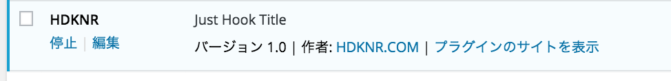
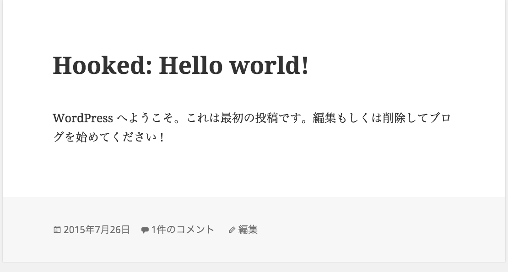

## ファイル

- {{wordpress}}/wp-content/plugins/your-plugin-name.php
- {{wordpress}}/wp-content/plugins/your-plugin-name/{{ files }}

## 単純な例

~~~bash
$ mkdir wp-content/plugins/hdknr
$ vim wp-content/plugins/hdknr/wp-hdknr.php
~~~

- プラグインメタ情報をコメントで記載
- タイトルを書き換えるフィルターの実装

~~~php
<?php 
/*
Plugin Name: HDKNR
Plugin URI: http://github.com/hdknr/hoge
Description: Just Echo Name
Version: 1.0
Author: HDKNR.COM
Author URI: http://hdknr.com
License: GPL2
*/
function myhook_title($title) {
    return 'Hooked: '.$title;
}
add_filter('the_title', 'myhook_title');
~~~

- ダッシュボード>プラグイン で有効

- トップページ表示

## リソース

- [Determining Plugin and Content Directories](https://codex.wordpress.org/Determining_Plugin_and_Content_Directories)