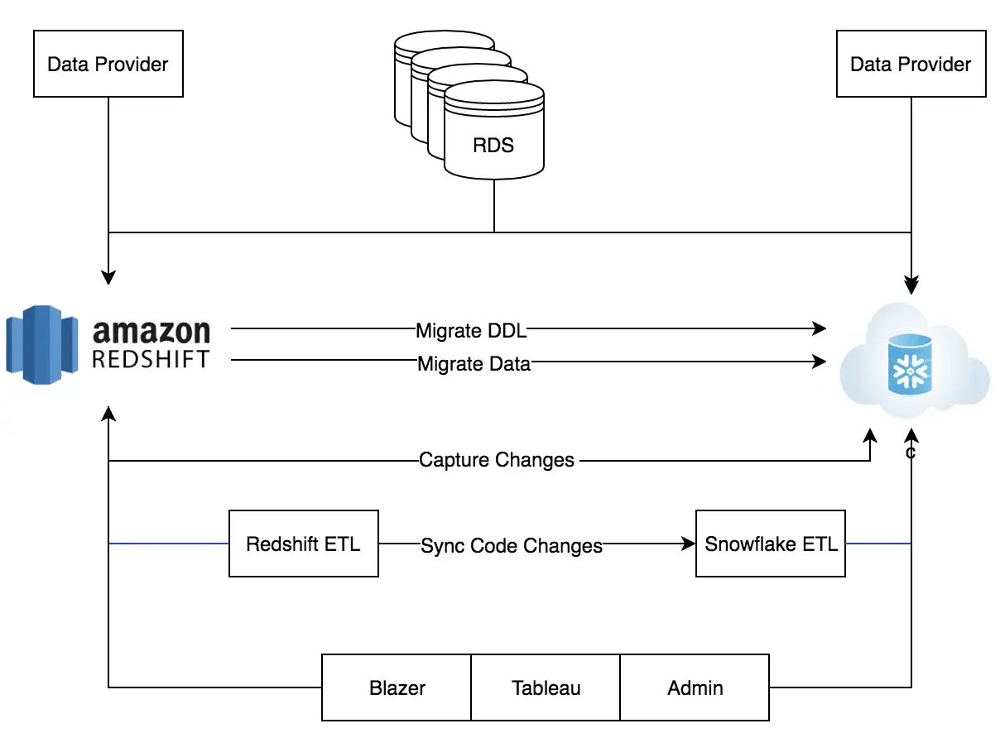

# Migrating from Redshift to Snowflake

How our Data Engineering team completed the massive “lift and shift”

Picture this:

It’s Monday around noon, and our ETL has just completed the previous day’s load after dealing with several issues overnight. 
We are at 85% disk full and Redshift VACUUM just kicked in to clean up all of our soft deletes from last week — nothing significant can run during this time. 
We pause all of our processes to let VACUUM complete its job. 
We’re paying for a cluster that reserves one day a week for data cleanup…

[AWS Redshift VACUUM](https://docs.aws.amazon.com/redshift/latest/dg/r_VACUUM_command.html)

Meanwhile, internal and external customers are raising flags about data freshness and overall slowness. 
The Data Engineering team is heads-down, closing out the backlog and dealing with operational issues instead of developing new functionality. 
Migrating to a different cluster configuration can take a full 48 hours, but we aren’t sure that it would resolve our speed issues.

This used to be a typical day for Instacart’s Data Engineering team. 
We build and maintain an analytics platform that teams across Instacart 
(Machine Learning, Catalog, Data Science, Marketing, Finance, and more) depend on to learn more about our operations and build a better product. 
Redshift was our cloud data storage warehouse for several years, 
and it served its purpose at the time…however we started running into scaling and stability issues as we grew, 
so we made the decision to migrate our platform to Snowflake. 
We pulled together some of our key migration observations and learnings to get you started on your own.

## The Strategy

We decided to clone the schemas and tables created in Redshift without major changes in data structure. 
Focusing on migration only (without changing structure) was key for the successful migration of our big, 
complicated system, filled with dependencies. 
This approach also allowed us to easily compare the data between the old system and the new system 
and run them in parallel to gain confidence before the official switch.

## Separation of Storage and Compute

One of the big advantages Snowflake architecture provides is the separation between storage and compute. 
We built a dedicated warehouse for our major applications and made sure to name the warehouse so it was easy to recognize who within the organization is using it. 
Once we provided the permissions for teams to use the warehouse, 
it was easy for us to identify the cost associated with each application and business unit. 
This is super helpful and something we could not do in Redshift.

## Code changes

We forked the git repository used by Redshift and modified the new branch to work with Snowflake. 
Every few days we merged the master branch to the new branch so we wouldn’t have a lot of conflicts to resolve during the final migration.

## Data and DDL migration

As our first step, 
we took all of the schemas in Redshift and created the same in Snowflake. 

We used an automated script that scanned Redshift information Schema for a given schema or table. 
We then extracted DDL (data definition language) from Redshift using vw_admin_generate_table_ddl (Redshift view), 
enhanced the DDL to Snowflake, 
unloaded data from Redshift to S3 and loaded it back to Snowflake in a new table. 
We ran that process several times during migration to make sure Snowflake data aligned with Redshift.

- https://github.com/awslabs/amazon-redshift-utils
- https://github.com/awslabs/amazon-redshift-utils/blob/master/src/AdminViews/v_generate_tbl_ddl.sql

Here are some of the code samples we used to pull DDL objects from Redshift:

~~~py
def run_data_migration(self, schema_name, table_name):

    self.logger.info("querying redshift metadata")

    pg_conn = pg.connect(cfg.REDSHIFT_DB_URL)
    print "pg_conn:", pg_conn
    pg_cursor = pg_conn.cursor()

    if table_name != "none":
        sql = """
              select table_schema,table_name
              from information_schema.tables
              where table_schema= '{0}'
              and table_type='BASE TABLE'
              and table_name like '{1}%' 
              """.format(
            schema_name, table_name
        )
    else:
        sql = """
              select table_schema,table_name
              from information_schema.tables
              where table_schema= '{0}'  
              and table_type='BASE TABLE' """.format(
            schema_name
        )

    pg_cursor.execute(sql)
~~~

Then, we generated the Redshift DDL:

~~~py
def get_table_ddl(self, table_name, schema_name):

    self.logger.info("querying redshift metadata")
    pg_conn = pg.connect(cfg.REDSHIFT_DB_URL)
    pg_cursor = pg_conn.cursor()
    sql = """
            select ddl
            from vw_admin_generate_table_ddl
            where tablename='{0}' 
            and schemaname='{1}' """.format(
        table_name, schema_name
    )
    pg_cursor.execute(sql)
    ddl = pg_cursor.fetchall()
    pg_cursor.close()
    print "ddl:", ddl
    return ddl
~~~

Afterward, 
we took the DDL and made it compatible with Snowflake. 
Snowflake’s support team provided us this script to migrate the DDL to Snowflake. Then we unloaded Redshift data to S3 and loaded it from S3 into Snowflake.

- https://gist.github.com/tamiroze/dc0bdd596ed2c6b70fe921061401e739

## The SQL challenge

Redshift and Snowflake use slightly different variants of SQL syntax. Here are the main differences that you might need to consider while migrating the code:

| Redshift                                | Snowflake                                                                                                                                                                                                        |
| --------------------------------------- | ---------------------------------------------------------------------------------------------------------------------------------------------------------------------------------------------------------------- |
| select GETDATE()                        | select CURRENT_TIMESTAMP()                                                                                                                                                                                       |
| select TRUNC(CURRENT_TIMESTAMP())       | select DATE_TRUNC(DAY,CURRENT_TIMESTAMP())                                                                                                                                                                       |
| select SYSDATE                          | select TO_TIMESTAMP_NTZ(CONVERT_TIMEZONE('UTC',CURRENT_TIMESTAMP()))                                                                                                                                             |
| select DATE(CURRENT_TIMESTAMP())        | select TO_DATE(CURRENT_TIMESTAMP())                                                                                                                                                                              |
| date_time_utc > GETDATE() - 7           | date_time_utc > dateadd('DAY', -7, TO_TIMESTAMP_NTZ(LOCALTIMESTAMP))                                                                                                                                             |
| select coalesce('a')                    | select coalesce('a', 'b') --you will get error message if you specify only one argument "SQL compilation error: error line 1 at position 7 not enough arguments for function [COALESCE('a')], expected 2, got 1" |
| DISTSTYLE                               | not used                                                                                                                                                                                                         |
| DISTKEY                                 | not used                                                                                                                                                                                                         |
| SORTKEY                                 | not used                                                                                                                                                                                                         |
| SORTKEY(col)                            | not used                                                                                                                                                                                                         |
| ENCODE                                  | not used                                                                                                                                                                                                         |
| interleaved                             | not used                                                                                                                                                                                                         |
| bpchar                                  | char                                                                                                                                                                                                             |
| character varying                       | varchar                                                                                                                                                                                                          |
| 'now'::character varying                | current_timestamp                                                                                                                                                                                                |
| identity(start, 0, ([0-9],[0-9])::text) | identity(start, 1)                                                                                                                                                                                               |

DML changes: Redshift has more lenient syntax for deleting tables.
 Snowflake is stricter with correct syntax, while Redshift can accept just delete table_name without the “from” key word. 
 (Personally, I prefer the Snowflake approach but I was surprised to find how many cases used the Redshift syntax.)

| Redshift         | Snowflake             |
| ---------------- | --------------------- |
| DELETE customers | DELETE from customers |

Semi-Structured Data: Both Snowflake and Redshift provide parsing capabilities for semi-structured data. You might need to change SQL to the format below in case you are parsing JSON in Redshift as Snowflake syntax is different.

[Semi-structured Data Functions](https://docs.snowflake.com/en/sql-reference/functions-semistructured.html)

| Redshift                                                    | Snowflake                              |
| ----------------------------------------------------------- | -------------------------------------- |
| json_extract_path_text (properties,'name')                  | parse_json(properties):name            |
| select json_extract_array_element_text('[111,112,113]', 2); | select parse_json('[111,112,113]')[2]; |

Snowflake provides variant datatype which we found valuable for (JSON, Avro, ORC, Parquet, or XML) and performed well as Snowflake stores these types internally in an efficient compressed columnar binary representation of the documents for better performance and efficiency.

[Querying Semi-structured Data](https://docs.snowflake.com/en/user-guide/querying-semistructured.html)

## Data Dictionary

Snowflake Information Schema is kept as UPPER case. If you are not using their Information Schema (less likely) you will be fine, but if you are referencing Information Schema, you might need to change it to lower or upper case letters in your query.

[Snowflake Information Schema](https://docs.snowflake.com/en/sql-reference/info-schema.html)

A note: This becomes a major problem if you reference it from Tableau. Tableau metadata is case sensitive meaning same field with upper vs lowercase is treated as two different fields, and as result, the report breaks. We ended up migrating all Tableau data sources manually with the help of an Interworks consulting team.

The upside to the manual Tableau migration: we performed some major cleanup. We discovered most of our data sources and dashboards where unused, and ended up migrating just 180 out of 3,000+ workbooks over.

We also experienced issues while running SELECT with UPPER function:

~~~sql
select *
from information_schema.tables
where table_name= upper('table_name');
# Instead make sure you send the string in UPPER case. Dont use the upper function.

select *
from information_schema.tables
where table_name= 'TABLE_NAME';
~~~

Snowflake will return the following error in case your Information Schema query is not selective enough.

    Information schema query returned too much data. Please repeat query with more selective predicates

## Snowflake default timestamp

Snowflake’s default account time zone is set to America/Los_Angeles, which means the database clock time will be PST. We ended up changing it to UTC after using it for a long time in PST, but this change was a bit scary as we did not know what might break. (My advice: check it before you start the implementation and set the time based on your needs. I strongly recommend UTC.)

~~~sql
show parameters like '%TIMEZONE%' in account;

#change your account setup in case you want a different timezone

alter account SET TIMEZONE = 'UTC';
~~~

[Parameters](https://docs.snowflake.com/en/sql-reference/parameters.html)

## Snowflake copy command

We found Redshift is way more forgiving with dates. During our data migration, we spotted many cases where Redshift was able to store a future date in a timestamp column, but Snowflake rejected that date. While I agree with rejecting non-realistic future dates like ‘11457–11–09’, it was hard for us to find the dates and clean them up, as Snowflake’s error messaging wasn’t as detailed as we would have liked.

In our case, we decided to use NULL_IF in the copy command, similar to the example below. Snowflake does not provide conditionals like “if date > ‘2030–01–01’ replace with null”. You must specify the exact date in order to mark it null.

~~~sql
copy into {0}{1} 
from {2} 
truncatecolumns = true 
file_format = 
( 
  field_optionally_enclosed_by='"' 
  escape_unenclosed_field='NONE' 
  type = csv 
  TRIM_SPACE = TRUE 
  field_delimiter = '|'
  null_if = ('', '11457–11–09') 
);
~~~

## Data comparison tool

Our ETL consumes thousands of tables from RDS dbs and produces tens of fact tables. The total storage at the time of migration was 1.2PB compressed. We run hundreds ETLs every day and at peak time we can have 50+ ETL runs simultaneously. We also migrated around 800 views that are used by our reporting tools.

It was impossible to manually compare the results between Redshift and Snowflake. We decided to build a comparison tool that provided us the following results:

    Select count of each table and compare results with Redshift.
    
    Select count distinct of each string column and compare with Redshift.
    
    Structure comparison of each table.
    
    Simple check if table exists.
    
    Select sum of each numeric column and compare with Redshift.

## Results

We ran both systems in parallel for a few weeks to compare data between the two. Then, once we were confident the migration was successful, we slowly switched the applications to use Snowflake as their main data source. We left our Redshift clusters live for one month after the migration and shut them down after confirming zero activity in Redshift stl_query.

Starting this massive migration project without support from upper management is a recipe for failure. Before starting the project make sure you get a commitment from management about resource allocation as different groups might be involved in migrating their code to be compatible with Snowflake.

While you won’t find all of the major hitches and differences between Snowflake and Redshift in this post, we hope the items above save you lots of time if you’re considering a migration.

While the migration is complete, the work is never over. Want to work on projects like this on Instacart’s Data Engineering team and share your findings? Check out our current openings.