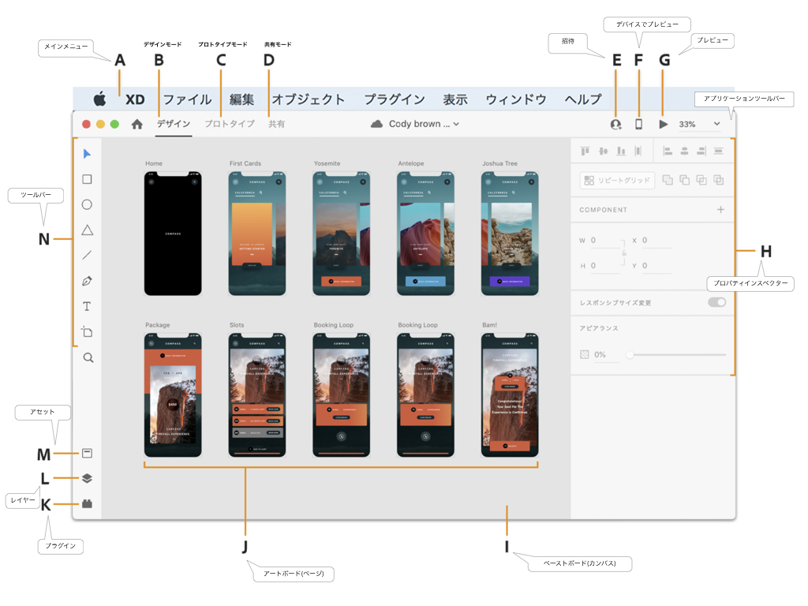

# Workspace

## A メインメニュー (macOSのメニュー)

メニュー:

- ファイル
- 編集
- オブジェクト
- 表示
- ウィンドウ
- ヘルプ

## B デザインモード

- プロジェクトを構成するアートボードを作成およびデザインできます。
- 他のツールを使用して作成されたアセットまたは Web で作成されたアセットを読み込むことができます。
- XD でグラフィックを作成することができます。

## C プロトタイプモード

- アートボード同士をリンク
- デザインのビデオデモを作成（現在は Mac のみ）
- デザインのプロトタイプをブラウザーまたはデバイスで作成
- 他のユーザーとプロトタイプを共有
- フィードバックを取得したりすることもできます。

## D 共有モード

共同で作成共有:

- デザインレビュー
- 開発
- プレゼンテーション
- ユーザーテスト用のリンク

## E ドキュメントに招待

- 共同編集（ベータ版）を有効にし、仲間のデザイナーを招待
- 1 つの XD ドキュメントに同時にアクセスして編集できます。

## F デバイスでプレビュー

- USB を介して複数のデバイスをデスクトップマシンに接続し、データを転送するようにセットアップして、ライブデバイスのプレビューを表示します。

## G プレビュー

プロトタイプテスト: 

- PC デスクトッププレビュー
- iOS や Android デバイスの Adobe XD アプリケーション

## H プロパティインスペクター

オプジェクトの操作：

- オブジェクトの様々なプロパティを定義
- 異なるオプションを使用してオブジェクトを操作
- 例: 背景、塗り、境界線、シャドウ、整列、オブジェクトサイズ
- 複数のオブジェクトを組み合わせて、まったく新しいオブジェクトを作成可能

`リピートグリッド`オプション:

- 繰り返すエレメントをレイアウト

固定位置オプション:

- スクロール時に複数のエレメントの位置を固定

数学計算:

- 精度の高いデザインを作成
- オブジェクトを新しい場所に移動
- オブジェクトの幅と高さを変更

## I, J ワークエリア

ワークエリア:

- `アートボード`: 作成したアセットを含む
- `ペーストボード` (`カンバス`): （アートボード周囲のグレーの領域）作業中の作品や既存のアートボードに含めない作品を配置可能

## 各種ツールバー（プラグイン(K)、レイヤー(L)、アセット(M)、ツール(N)）

- 選択ツール
- 描画ツール
- テキストツール
- アートボードツール
- アセット
- レイヤーパネル

## アプリケーションツールバー (OSウィンドウにあるツールバー)

- デザインモード、プロトタイプモード、カンバスのズームレベル、プレビュー、共有オプションにアクセスできます。
