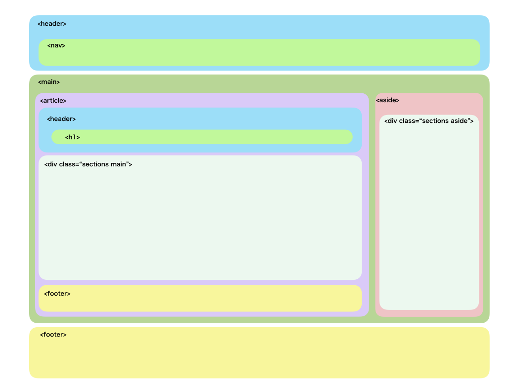
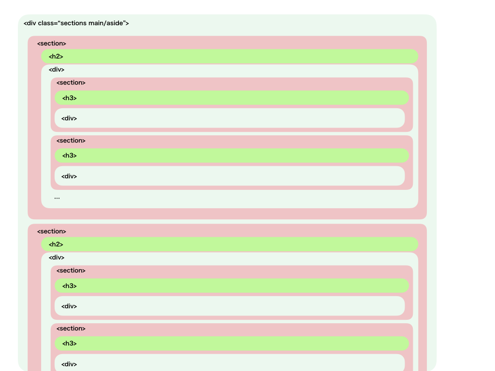

- [検索エンジン最適化スターターガイド - Google](http://static.googleusercontent.com/media/www.google.co.jp/ja/jp/intl/ja/webmasters/docs/search-engine-optimization-starter-guide-ja.pdf)
- [SEO対策として最低限押さえておきたいHTML/HTML5マークアップの大事な6つのポイント](https://creive.me/archives/8814/)
- [SEOに重要なタグ12個の正しい使い方](http://w-just.com/blog/seo-tag-358.html)(`title`, `h1`, `h2`, `h3`, `a`, `strong`, `em`, `ol`, `ul`, `li`, `p`, `table`, `description`, / `br`, `b`, `hr`)

## h1

- [SEO１位のための「h1」タグ設定ガイド](https://seopack.jp/seoblog/20160817-h1-guide-to-get-on-top/)

## セクショニング(構造)

グローバル:

