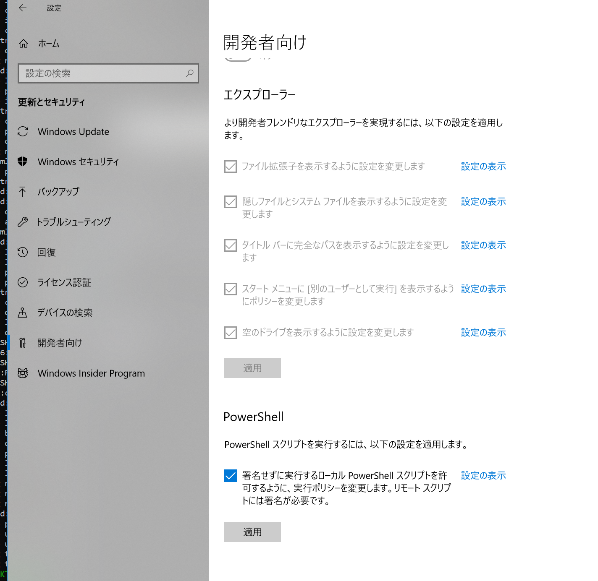
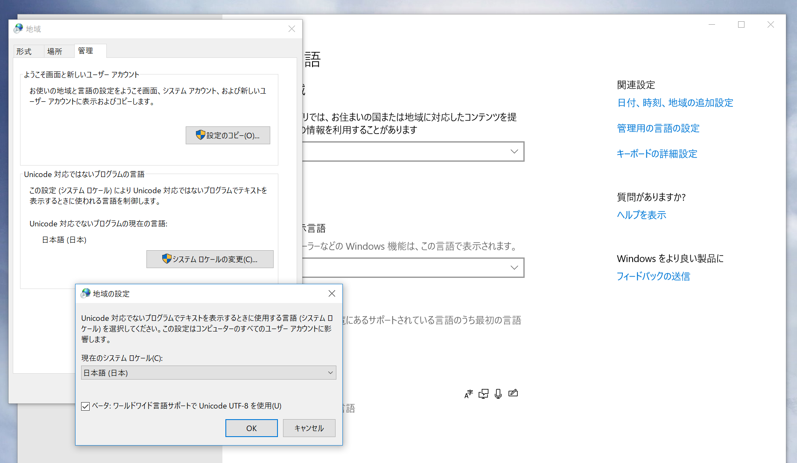

# 設定

## エクスプローラで拡張子を表示

- `設定` > `更新とセキュリティ`

## UTF8

## ネットワーク共有

- [Windows10とMac OS Xの共有ファイル設定方法 | 端末ごとに解説 - その他ビジネス | ボクシルマガジン](https://boxil.jp/mag/a43/)

## RDP

- [Windows 10 homeにリモートデスクトップ接続できるようにする | 無停電電源装置(UPS) | イートン](https://www.eaton-daitron.jp/techblog/5726.html)
- [リモートデスクトップの接続を許可する方法 ( Windows 10 ) | ドスパラ サポートFAQ よくあるご質問｜お客様の｢困った｣や｢知りたい｣にお応えします。](http://faq3.dospara.co.jp/faq/show/06300?site_domain=default)
