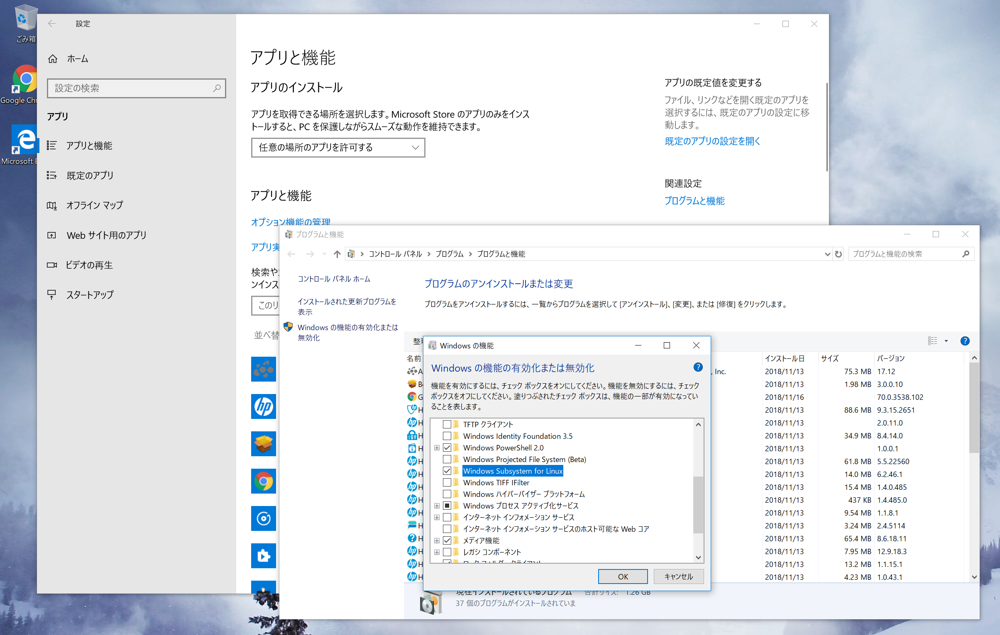
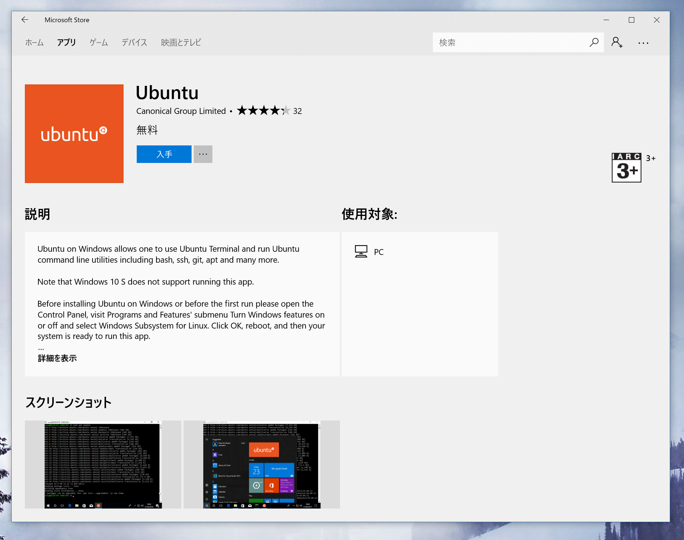

# WSL

## インストール

- `スタート` > `設定` > `アプリ`
- `プログラムと機能` > `コントロールパネル`
- `Windowsの機能の有効化または無効化`
- ツリーから `Windows Subsystem for Linux` を選択して再起動

## WSL2

管理者権限で "Linux 用 Windows サブシステム"をオンにする:

~~~ps1
PS> dism.exe /online /enable-feature /featurename:Microsoft-Windows-Subsystem-Linux /all /norestart
~~~

"仮想マシン プラットフォーム"をオン:

~~~ps1
PS> dism.exe /online /enable-feature /featurename:VirtualMachinePlatform /all /norestart
~~~

再起動:

通常ユーザーで、WSL2を既定のWSLバージョンとして設定:

~~~ps1
PS> wsl --set-default-version 2
~~~

Windows Store:

- https://www.microsoft.com/ja-jp/p/ubuntu-2004-lts/9n6svws3rx71?activetab=pivot:overviewtab

WindowsのスタートメニューからUbuntu 20.04 を起動

- ubutnu 管理者のパスワード設定

Ubuntuのバージョンを変更:

~~~ps1
PS> wsl --list --verbose
PS> wsl --set-version <distribution name> <versionNumber>
~~~

## "Ubuntu"をMicrosoft Storeから入れる

- `スタート`> `Microsoft Store`
- 検索 "Linux"
- `Ubuntu` ダウンロード(214.4MB)
- `インストール` 

