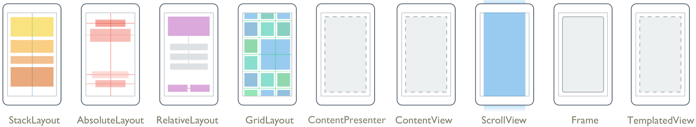

# 記事

- [Xamarin.Forms レイアウト（Formsを使用したアプリ作成の次の１歩）](http://dev.classmethod.jp/smartphone/xamarin-forms-layout/)
- [iPhone開発者のためのAndroid入門【Viewの配置】](http://labs.techfirm.co.jp/android/cho/1890)
- http://mymo.blog8.fc2.com/blog-entry-43.html  

ViewGroup
- ようするにレイアウト?

# レイアウト

- [Xamarin.Forms Layouts](https://developer.xamarin.com/guides/xamarin-forms/controls/layouts/)

複数の子要素を格納できる(Children)

- [StackLayout](https://developer.xamarin.com/api/type/Xamarin.Forms.StackLayout/)
- [AbsoluteLayout](https://developer.xamarin.com/api/type/Xamarin.Forms.AbsoluteLayout/)
- [Grid](https://developer.xamarin.com/api/type/Xamarin.Forms.Grid/)
- [RelativeLayout](https://developer.xamarin.com/api/type/Xamarin.Forms.RelativeLayout/)

単一の子要素(Content)

- [ContentView](https://developer.xamarin.com/api/type/Xamarin.Forms.ContentView/)
- [Frame](https://developer.xamarin.com/api/type/Xamarin.Forms.Frame/)
- [ScrollView](https://developer.xamarin.com/api/type/Xamarin.Forms.ScrollView/)
- [TemplatedView](https://developer.xamarin.com/api/type/Xamarin.Forms.TemplatedView/)

- [ContentPresenter](https://developer.xamarin.com/api/type/Xamarin.Forms.ContentPresenter/)

# iOS

- http://stackoverflow.com/questions/31080235/creating-a-uiview-renderer
